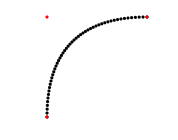

# VectorArr bezierCurve(VectorArr controlPoints, double t = 0.02)
Makes a bezier curve from a list of control points and the given number to increment t by.

## Parameters
- `controlPoints` - The list of control points to make the curve from
- `t` - The number to increment t by. The default is 0.02

## Returns
A list of points on the curve

## Example
```cpp
VectorArr controlPoints = {PVector(0, 0), PVector(0, 1), PVector(1, 1)};
VectorArr curve = bezierCurve(controlPoints);
```
The above code will make a curve that looks like this:

