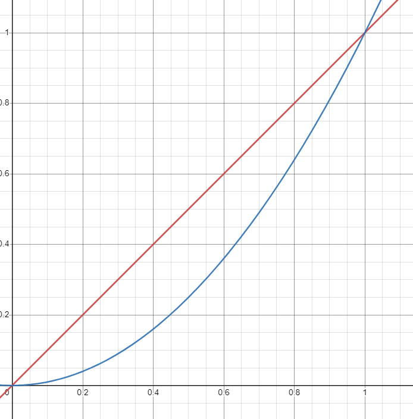

# DriveController
The DriveController class is used to control the drive motors of the robot. It is used in the driver control period to control the robot's movement.

## Inner Workings
This class allows for two primary things: joystick thresholding and speed curving. 

Joystick thresholding allows the joystick to not be considered active until it reaches a certain value. This is extremely useful because some controllers will have a "phantom" activation that causes the robot to move very slowly when the joysticks are not being touched. 

Speed curving alows the user to vary how the speed changes with the joystick. Lib46f comes with a default quadratic speed curve that keeps the robot slow when the joystick is at small values, then sends it at max power when the joystick is is at max: 

